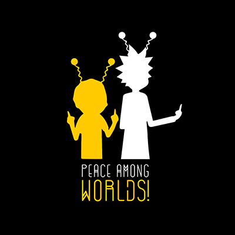

<!-- AUTO-GENERATED-CONTENT:START (STARTER) -->

  

<h1 align="center">
  Rick And Morty
</h1>

This small project of a _Rick and Morty API_ is one of the 4 challenges in the **'Frontend Bootstrapping'** workshop. I created this project of 0. I made its HTML structure and CSS styles.  I decided on the design of the page based on the color combination of the mother page. The characters are called from the API through Javascript.

## 🚀 To view the website you can click on the link below

<a href="https://rickandmorty-xd.firebaseapp.com/">rickandmorty-xd.firebaseapp.com</a>

## 🧐 Thanks for reading me. See you!

